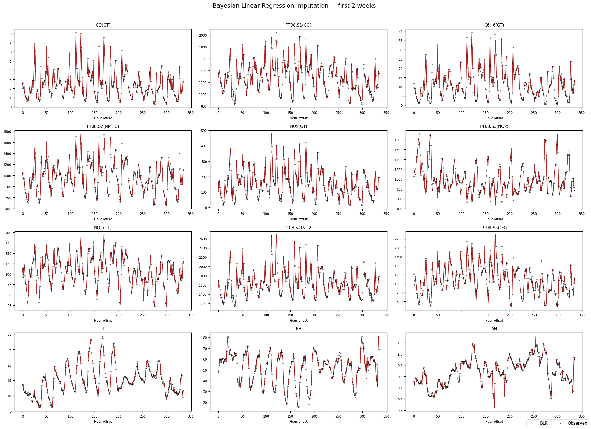
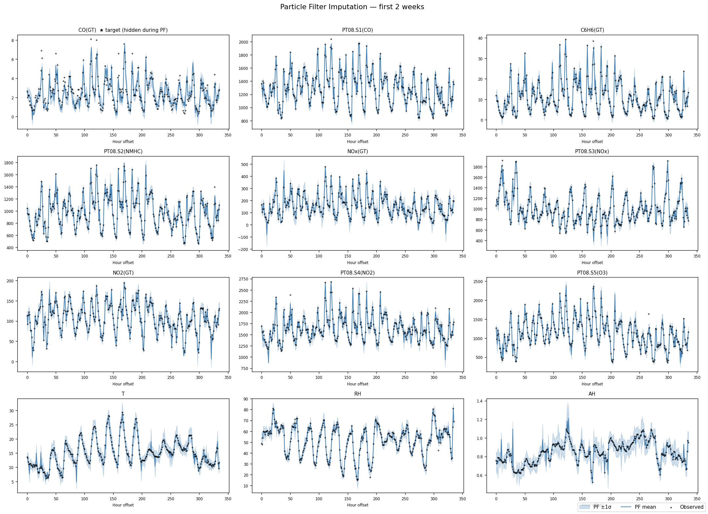
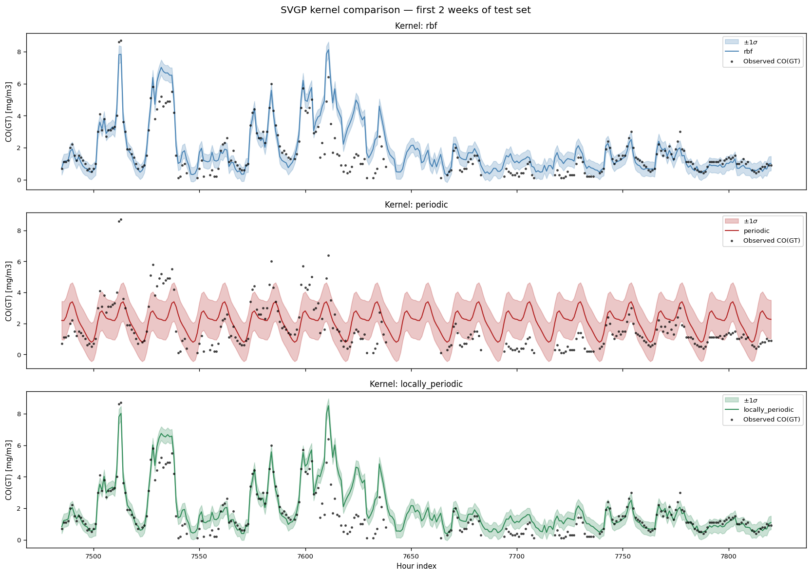
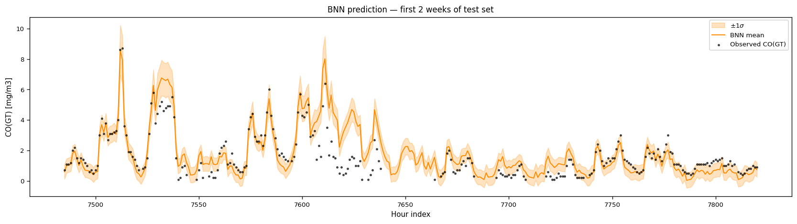
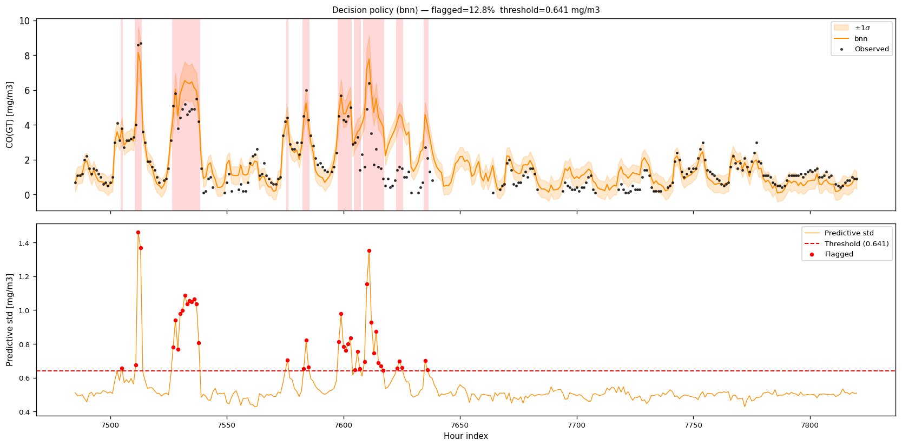
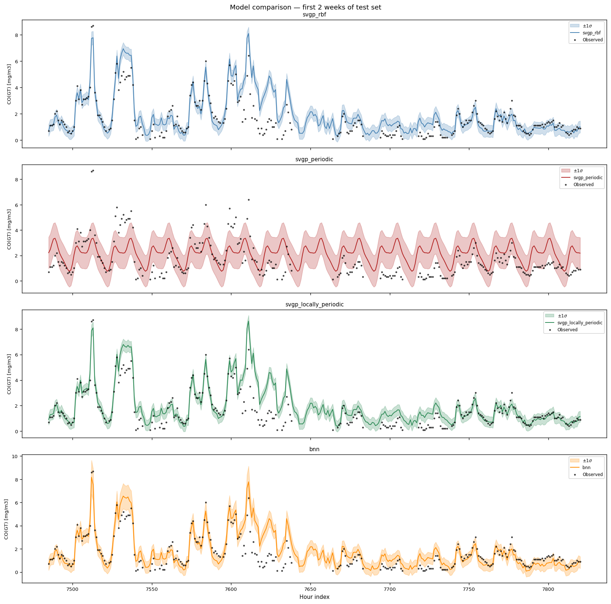

# Probabilistic Air Quality Prediction

End-to-end probabilistic machine learning pipeline for forecasting CO concentration (mg/m³) from the [UCI Air Quality dataset](https://archive.ics.uci.edu/dataset/360/air+quality). The pipeline covers data imputation, model training, uncertainty quantification, and an interactive web frontend — all test-driven and containerised with Docker.

---

## Table of Contents

1. [Overview](#overview)
2. [Pipeline Phases](#pipeline-phases)
3. [Results](#results)
4. [Repository Structure](#repository-structure)
5. [Setup](#setup)
6. [Training the Models](#training-the-models)
7. [Running the Frontend Locally](#running-the-frontend-locally)
8. [Running with Docker](#running-with-docker)
9. [Testing](#testing)

---

## Overview

| Property | Detail |
|---|---|
| **Target** | CO(GT) — hourly CO concentration (mg/m³) |
| **Dataset** | UCI Air Quality, 9 358 hourly records (March 2004 – April 2005) |
| **Models** | Sparse Variational GP (3 kernels) · Bayesian Neural Network (VI) |
| **Uncertainty** | Full decomposition into epistemic + aleatoric components |
| **Frontend** | Streamlit app with model toggle, uncertainty bar chart, decision policy |
| **Packaging** | Docker (uv-based build, CPU inference) |
| **Tests** | 106 unit tests across all pipeline stages |

---

## Pipeline Phases

### Phase 1 — Data Loading & EDA
Raw CSV ingestion with European locale parsing (`;` separator, `,` decimal). Missing values encoded as `-200` are replaced with `NaN`. Builds a sorted `DatetimeIndex` and retains the 13 feature columns defined in `src/config.py`.

### Phase 2 — Probabilistic Imputation (Particle Filter)
A Rao-Blackwellised **Particle Filter** with a **Bayesian Linear Regression** observation model imputes missing sensor readings. The filter treats CO(GT) as a hidden state and uses all other sensors as observations. The imputed dataset is saved to `data/processed/pf_imputed.csv`.

> Two separate plots are generated — one per method — so neither obscures the other.

**Bayesian Linear Regression** (firebrick line vs observed scatter):



**Particle Filter** (steelblue mean + ±1σ band vs observed scatter):



### Phase 3 — Sparse Variational Gaussian Process (SVGP)
Three kernel variants are trained via mini-batch ELBO optimisation (GPyTorch):

| Kernel | Description |
|---|---|
| **RBF** | ARD over sensor features only — captures feature-space proximity |
| **Periodic** | Strict 24 h daily cycle on the time axis |
| **Locally Periodic** | Periodic × RBF — daily envelope modulated by sensor similarity |

Inducing points (M = 200) are initialised with K-Means; the periodic kernel uses phase-uniform spacing to avoid Gram-matrix collapse.



### Phase 4 — Bayesian Neural Network (Bayes by Backprop)
A **heteroscedastic BNN** with two Bayesian hidden layers (64 → 64 units). Every weight and bias carries a Gaussian variational posterior `q(w) = N(μ, softplus(ρ)²)`. The network outputs both a predicted mean and a log-variance (aleatoric noise). Training minimises the ELBO:

```
L = E_q[NLL(y | x, w)] + KL[q(w) ∥ p(w)] / N
```

where `p(w) = N(0, 1)` and the KL is computed in closed form.



### Phase 5 — Unified Evaluation & Decision Policy
All four models are evaluated on the same 20 % held-out test split:

| Model | RMSE | NLL | Coverage@1σ | Coverage@2σ |
|---|---|---|---|---|
| SVGP RBF | 0.5971 | 0.9805 | 75.5 % | 89.9 % |
| SVGP Periodic | 1.1852 | 1.5904 | 74.5 % | 95.7 % |
| SVGP Locally Periodic | 0.6029 | 1.0519 | 73.6 % | 87.6 % |
| **BNN** | **0.5928** | **0.8360** | **77.1 %** | **94.3 %** |

The **BNN achieves the best RMSE and NLL**, with well-calibrated coverage close to the theoretical 68 % / 95 % targets.

An **Uncertainty Decision Policy** flags the top 10 % most uncertain predictions (90th-percentile threshold) for human review:



*Top panel:* red-shaded intervals mark flagged (high-uncertainty) hours. *Bottom panel:* predictive std with the threshold line and flagged points in red.



### Phase 6 — Uncertainty Decomposition & Scalability Profiling
`predict_bnn_decomposed` and `predict_svgp_decomposed` split the total predictive variance using the **law of total variance**:

```
Var[Y] = E[Var[Y|w]]  +  Var[E[Y|w]]
           aleatoric        epistemic
```

`scripts/profile_scalability.py` loads trained checkpoints and measures inference latency (ms/run), peak RAM (MB), and estimated training time for each model.

### Phase 7 — Interactive Streamlit Frontend
A browser-based UI with:
- **Model toggle** — switch between BNN and GP (Locally Periodic) with two buttons
- **12 sensor sliders** with realistic UCI dataset min/max/defaults and physical units
- **Uncertainty bar chart** — epistemic vs aleatoric vs total std
- **Decision policy banner** — ⚠️ warning when total std exceeds the calibration threshold

### Phase 8 — Docker Packaging
The frontend is packaged into a single Docker image using `uv` for reproducible dependency installation.

---

## Repository Structure

```
.
├── data/
│   ├── raw/                        # AirQualityUCI.csv (not tracked by git)
│   └── processed/                  # Generated artefacts (CSVs, PNGs, .pt checkpoints)
├── src/
│   ├── config.py                   # Paths and column definitions
│   ├── data/loader.py              # Raw dataset ingestion
│   ├── imputation/
│   │   ├── particle_filter.py      # Rao-Blackwellised particle filter
│   │   └── bayesian_linear.py      # BLR observation model
│   ├── models/
│   │   ├── sparse_gp.py            # SVGPModel, train_svgp, predict_svgp[_decomposed]
│   │   └── bnn_vi.py               # BNNRegressor, train_bnn, predict_bnn[_decomposed]
│   ├── evaluation/
│   │   ├── metrics.py              # RMSE, NLL, empirical coverage
│   │   └── decision_policy.py      # UncertaintyPolicy (threshold-based flagging)
│   └── frontend/
│       └── app.py                  # Streamlit application
├── scripts/
│   ├── run_imputation.py           # Phase 2 — run particle filter
│   ├── train_gp.py                 # Phase 3 — train SVGP models
│   ├── train_bnn.py                # Phase 4 — train BNN
│   ├── evaluate.py                 # Phase 5 — unified evaluation + plots
│   └── profile_scalability.py      # Phase 6 — latency / memory profiling
├── tests/                          # 106 unit tests (pytest)
├── Dockerfile
├── .dockerignore
└── pyproject.toml
```

---

## Setup

**Prerequisites:** Python 3.10+, [uv](https://github.com/astral-sh/uv), and the raw dataset file `AirQualityUCI.csv` placed in `data/raw/`.

```bash
# Clone the repository
git clone https://github.com/mariokroll/uci-air-quality-prediction
cd uci-air-quality-prediction

# Install all dependencies (creates .venv automatically)
uv sync
```

---

## Training the Models

All scripts must be run from the **repository root** in order (each phase depends on the previous one).

### Step 1 — Imputation (required before any model training)

```bash
uv run python -m scripts.run_imputation
```

Outputs `data/processed/pf_imputed.csv`, `imputation_comparison_blr.png`, and `imputation_comparison_pf.png`.

---

### Step 2 — Train the Sparse GP

```bash
uv run python -m scripts.train_gp
```

Trains three SVGP variants (RBF, Periodic, Locally Periodic) for 100 epochs each.

**Outputs:**
- `data/processed/svgp_rbf.pt`
- `data/processed/svgp_periodic.pt`
- `data/processed/svgp_locally_periodic.pt`
- `data/processed/svgp_meta.pt` — preprocessing metadata (scaler, feat_cols, threshold)
- `data/processed/gp_predictions.png`
- `data/processed/gp_metrics.csv`

---

### Step 3 — Train the BNN

```bash
uv run python -m scripts.train_bnn
```

Trains the heteroscedastic BNN for 100 epochs and computes the calibration threshold.

**Outputs:**
- `data/processed/bnn_model.pt` — weights, scaler, feat_cols, calib_threshold
- `data/processed/bnn_predictions.png`
- `data/processed/bnn_metrics.csv`

---

### Step 4 — Unified Evaluation (optional)

```bash
uv run python -m scripts.evaluate
```

Trains all four models from scratch on the same split and produces the comparison plots.

**Outputs:**
- `data/processed/eval_metrics.csv`
- `data/processed/eval_predictions.png`
- `data/processed/eval_decision_policy.png`

---

### Step 5 — Scalability Profiling (optional)

Requires trained checkpoints from Steps 2 and 3.

```bash
uv run python -m scripts.profile_scalability
```

**Outputs:**
- `data/processed/scalability_metrics.csv` — latency, RAM, estimated training time

---

## Running the Frontend Locally

Requires trained checkpoints (`bnn_model.pt`, `svgp_locally_periodic.pt`, `svgp_meta.pt`).

```bash
uv run streamlit run src/frontend/app.py
```

Open `http://localhost:8501` in your browser.

The app lets you:
1. Toggle between **BNN** and **GP (Locally Periodic)** with the buttons at the top
2. Adjust 12 sensor sliders to the current environmental conditions
3. Click **Predict** to get a CO(GT) estimate with a full uncertainty breakdown
4. See a ⚠️ warning if the prediction is flagged by the decision policy

---

## Running with Docker

### Prerequisites

Train both models first so the checkpoints exist:

```bash
uv run python -m scripts.run_imputation
uv run python -m scripts.train_gp
uv run python -m scripts.train_bnn
```

### Build the image

```bash
docker build -t air-quality-predictor .
```

> **CPU-only build (smaller image):** Edit the `url` under `[[tool.uv.index]]` in `pyproject.toml` to `https://download.pytorch.org/whl/cpu` before building.

### Run the container

```bash
docker run -p 8501:8501 air-quality-predictor
```

Open `http://localhost:8501` in your browser.

---

## Testing

The full test suite covers all pipeline stages (106 tests):

```bash
uv run pytest tests/ -v
```

| Test file | What it covers |
|---|---|
| `test_data.py` | Raw loader, sentinel replacement, DatetimeIndex |
| `test_imputation.py` | Particle filter correctness, BLR, blackout recovery |
| `test_models.py` | SVGP architecture, kernel construction, training loop |
| `test_bnn.py` | BayesianLinear, ELBO loss, MC prediction, OOD uncertainty |
| `test_evaluation.py` | RMSE / NLL / coverage metrics, UncertaintyPolicy |
| `test_phase6.py` | Variance decomposition, profiling helpers |
